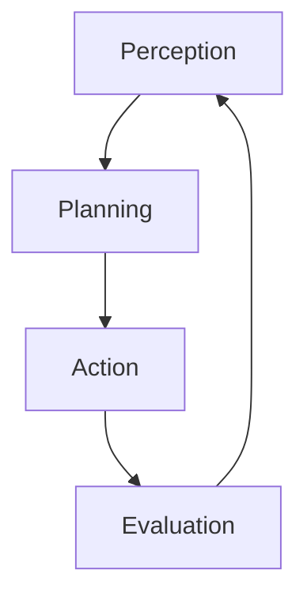

# Agentic RAG, corrective rag (CRAG)

Retrieving information to help generative AI is a delicate process, it is easy to get started with searches adn vector searches but it is hard to ensure the right data is loaded. **Agentic RAG** approaches are bringing in more power and approaches to load context to satisfy the user requests and application goals.

In its msot simple form an agent perform the following loop


Using generative ai and providing tools to teh `Action` step the agent is able to consume additional logic.

**Corrective RAG** systems (**CRAG**) reson about the user request and the current context, it then evaluates how supportive and useful it is, if the context can help accomplising the task the response is generated otherwise it will plan actions to cover the gap in the context. A classic approach here is to try to use in house data (this could be a vector search like in [RAG Chatbot](6_RAGChatbot.md)) and after evaluating the context relevancy it might need to search the web using search engine like [Bing](www.bing.com) to supplement the missing parts. It could also generate better query to probe again the **RAG** element

In this exercise you will build on top of the [RAG Chatbot](6_RAGChatbot.md) and tool calling example to implement a **CRAG** system for the [eShopSupport](https://github.com/dotnet/eShopSupport)

## Project setup

*Prerequisites: These instructions assume you've done earlier sessions, in particular session 1, which gives the basic environment setup steps.*

If you're not already running Qdrant, start it in Docker now:

```
docker run -p 6333:6333 -p 6334:6334 -v qdrant_storage:/qdrant/storage:z -d qdrant/qdrant
```

If you have not populate (if you already completed the [RAG Chatbot](6_RAGChatbot.md) lesson you should be good to go now) the collection then load pdfs:

 * Open the project `exercises/CorrectiveRetrievalAugmentedGeneration/Begin`
 * If you're using VS, ensure that `Ingestion` is marked as the startup project. For non-VS users, `Ingestion` is the project you should be ready to `dotnet run`.
 * Open `Program.cs`. Follow the instructions at the top, which explain how to:
   * Make sure Ollama is running and has the `all-minilm` model available
   * Make sure Qdrant, a vector database, is running in Docker

If you run the project, you should see it claim to ingest many PDFs, this is will populate a collection in the [Qdrant](https://qdrant.tech/) .

This might take a minute or so. While it's going, you might like to go into the Qdrant dashboard at http://localhost:6333/dashboard. You should see it has a single collection called `manuals`, and if you go into it and visit the *Info* tab, it should say it has `points_count` of some amount. It doesn't update continuously, but if you refresh every few seconds you'll see the count go up.

When your ingestion process completes, you should have thousands of "points" (i.e., chunks of text from product manuals) in your vector database.